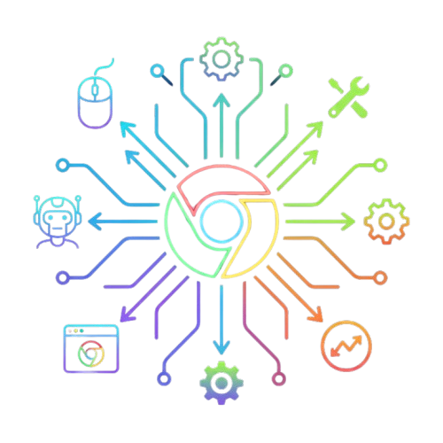

# Custom Chrome MCP Server



**Your Intelligent Bridge Between AI and the Browser.**

This Model Context Protocol (MCP) server enables AI assistants like Claude, Roo Code, or Windsurf to interact with Google Chrome in a **natural, powerful, and stealthy way**. Unlike other automation tools, this solution connects to your actual browser profile, allowing you to use your existing login sessions, cookies, and extensions without detection.

---

## ✨ Why Use This?

*   **🕵️ "Human" Navigation:** Uses your real Chrome profile. If you're logged into LinkedIn, Gmail, or your corporate ERP, your AI assistant is too.
*   **🛡️ Undetectable:** Advanced "Shadow Profile" technology prevents browser automation blocking on complex sites.
*   **🛠️ Robust Toolset:** Over 40+ specialized tools optimized for data scraping, specific element extraction, and visual analysis.
*   **⚡ Fast & Safe:** Safely executes scripts and screenshots, with intelligent output truncation to prevent crashing your AI context.

---

## 🚀 Quick Installation

### For Users (VS Code / Roo Code / Claude Desktop)

Simply add this to your `mcp.json` configuration file:

```json
{
  "mcpServers": {
    "chrome-devtools-advanced-mcp": {
      "command": "npx",
      "args": ["-y", "chrome-devtools-advanced-mcp", "--port=9223"]
    }
  }
}
```

Restart your assistant (Ctrl+R in VS Code), and you'll have instant access.

---

## 💡 Simplified Usage Guide

### 1. Launch the Browser
First, ask your AI:
> *"Launch Chrome with my default profile"*

This triggers `launch_chrome_with_profile`, creating a controllable Chrome instance without closing your other windows.

### 2. Navigate & Analyze
You can ask:
*   *"Go to amazon.com and search for laptops"*
*   *"Analyze the HTML of the login form"* (Uses optimized `get_html`)
*   *"Take a screenshot of the pricing table"*

### 3. Interact
The AI can click, type, and fill forms intelligently, waiting for elements to load automatically.

---

## 🛠️ Tool List

<details>
<summary><strong>👇 Click here to view all available tools</strong></summary>

### 🎭 Browser & Session Control
| Tool | Description |
|------|-------------|
| `launch_chrome_with_profile` | **Start Here!** Launches Chrome with your cookies/extensions. |
| `browser_action` | Navigate, reload, go back/forward. |
| `manage_tabs` | Create, close, switch, or list tabs. |
| `close_browser` | Safely closes the controlled session. |

### 🔍 Analysis & Extraction
| Tool | Description |
|------|-------------|
| `get_html` | **Critical.** Extracts simplified or full HTML. Supports selectors. |
| `screenshot` | Captures visual proof (png/jpeg). |
| `get_page_metrics` | Layout and viewport analysis. |
| `get_accessibility_tree` | See the page structure as screen readers do. |

### 🖱️ Interaction
| Tool | Description |
|------|-------------|
| `perform_interaction` | Click, Type, Hover, Drag & Drop with auto-wait. |
| `execute_script` | Run custom JavaScript safely (requires `return`). |
| `extract_element_data` | Get specific text or attributes from elements. |
| `set_viewport` | Resize window for responsive testing. |

### 🛡️ Anti-Detection & Privacy
| Tool | Description |
|------|-------------|
| `enable_stealth_mode` | Hides automation flags. |
| `set_user_agent` | Spoof device/browser identity. |
| `set_geolocation` | Mock GPS coordinates. |
| `set_timezone` | Change browser timezone. |

### 📡 Network (Advanced)
| Tool | Description |
|------|-------------|
| `capture_network_on_action` | Record traffic while performing an action. |
| `resend_network_request` | Replay captured API calls. |
| `start_har_recording` | Save full network logs (HAR format). |
| `monitor_websocket_messages` | Listen to socket traffic. |

### 🍪 Storage & Cookies
| Tool | Description |
|------|-------------|
| `get_cookies` / `set_cookie` | Manage browser cookies. |
| `get_local_storage` | Read/Write local storage data. |
| `export_session` | Save current session state to file. |

</details>

---

## ❓ FAQ

**Do I need to close my Chrome?**
No! Thanks to "Shadow Profile" technology, this server creates a temporary safe clone of your profile. You can keep browsing normally while the AI works in parallel.

**Does it work on Mac/Linux?**
Yes, it is fully cross-platform.

**I see "Tool disabled by user" error**
This is a VS Code security feature.
1. Reload VS Code (`Ctrl+R`).
2. When the AI tries to use a tool again, click **"Always Allow"** on the popup.

---

## 👨‍💻 For Developers

To contribute or run locally:

```bash
git clone https://github.com/Eddym06/devTools-Advance-mcp.git
cd custom-chrome-mcp
npm install
npm run build
npm start
```

---
*Developed with ❤️ by @eddym06*
